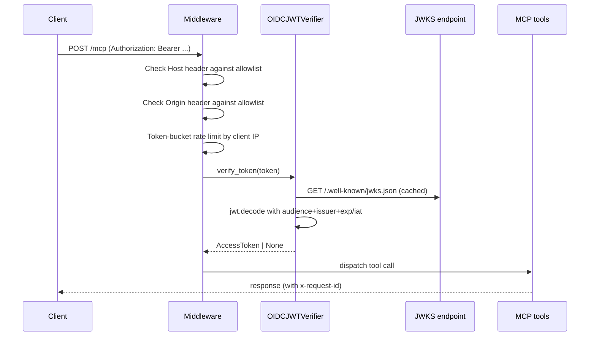

# Remote ASGI deployment

The same `mcp` instance can be served as an ASGI app over MCP's Streamable HTTP transport. This mode adds OIDC bearer-token validation, host/origin allowlists, request logging with correlation IDs, and an in-memory rate limiter.

## Purpose

Make the news server reachable from remote clients over HTTPS while remaining a resource server only — never an OAuth authorization server.

## Install

```bash
pip install "anthropic-news-mcp[remote]"
```

The `[remote]` extra adds `PyJWT[crypto]`, `starlette`, and `uvicorn`. Without these dependencies, importing `remote.OIDCJWTVerifier` raises a clear runtime error.

## Required environment

Startup fails with a `RuntimeError` (refusing insecure remote MCP startup) unless all four of these are set:

| Variable | Purpose |
|----------|---------|
| `ANTHROPIC_NEWS_MCP_AUTH_ISSUER` | OIDC issuer URL, e.g. `https://issuer.example` |
| `ANTHROPIC_NEWS_MCP_AUTH_AUDIENCE` | Expected JWT audience claim, e.g. `anthropic-news` |
| `ANTHROPIC_NEWS_MCP_ALLOWED_HOSTS` | Comma-separated hosts allowed in the `Host` header |
| `ANTHROPIC_NEWS_MCP_ALLOWED_ORIGINS` | Comma-separated origins allowed in the `Origin` header |

Optional:

| Variable | Default | Purpose |
|----------|---------|---------|
| `ANTHROPIC_NEWS_MCP_REQUIRED_SCOPES` | `anthropic-news:read` | Scopes the JWT must include |
| `ANTHROPIC_NEWS_MCP_RESOURCE_SERVER_URL` | `https://<first allowed host>` | Resource server URL for the OAuth metadata document |
| `ANTHROPIC_NEWS_MCP_RATE_LIMIT_PER_MINUTE` | `120` | Token-bucket refill rate per client |
| `ANTHROPIC_NEWS_MCP_RATE_LIMIT_BURST` | `30` | Token-bucket capacity per client |

## Run

```bash
export ANTHROPIC_NEWS_MCP_AUTH_ISSUER="https://issuer.example"
export ANTHROPIC_NEWS_MCP_AUTH_AUDIENCE="anthropic-news"
export ANTHROPIC_NEWS_MCP_ALLOWED_HOSTS="mcp.example.com"
export ANTHROPIC_NEWS_MCP_ALLOWED_ORIGINS="https://client.example"
uvicorn anthropic_news_mcp.asgi:app --host 0.0.0.0 --port 8000
```

The MCP endpoint is `/mcp`.

## Module layout

| Module | Purpose |
|--------|---------|
| `src/anthropic_news_mcp/asgi.py` | Lazy entrypoint: `app` is created on first attribute access |
| `src/anthropic_news_mcp/remote.py` | Auth config, JWT verifier, middleware, app factory |

## Lazy app creation

```python
# asgi.py
def __getattr__(name: str) -> object:
    if name == "app":
        from .remote import create_app
        return create_app()
    raise AttributeError(name)
```

This defers `create_app()` until something actually accesses `app`. Importing `anthropic_news_mcp.asgi` (e.g. for tests, or for tooling that introspects ASGI modules) does not require the remote env vars to be set.

## Auth flow



`OIDCJWTVerifier`:

- Lazily initializes a `PyJWKClient` against `${issuer}/.well-known/jwks.json`.
- On `verify_token(token)`, runs `get_signing_key_from_jwt` in an executor (the call is sync), then `jwt.decode(token, key, algorithms=["RS256", "ES256"], audience, issuer, options={"require": ["exp", "iat"]})`.
- Extracts scopes from `scope` (string), `scp` (string or list).
- Builds a `mcp.server.auth.provider.AccessToken` carrying token, client_id (`client_id`/`azp`/`sub`), scopes, expiry, and resource URL.
- Returns `None` on any failure — the SDK rejects the request.

## Middleware

Two middlewares are registered in order (innermost first):

`HostOriginMiddleware`:

- Rejects requests whose `Host` header is not in `allowed_hosts` with HTTP 403 `host_not_allowed`.
- Rejects requests whose `Origin` (when present) is not in `allowed_origins` with HTTP 403 `origin_not_allowed`.
- Always returns the `x-request-id` header.
- Logs structured warnings (`remote_request_denied`) on rejection.

`RequestLogRateLimitMiddleware`:

- Rate-limits per `request.client.host` via a `_TokenBucket`.
- Returns HTTP 429 `rate_limited` when exhausted.
- Logs structured info (`remote_request`) on every request with method, path, status code, duration, request ID, and client IP.
- Generates a fresh `x-request-id` if the client didn't send one.

The token bucket is process-local — for multi-process deployments, put rate limiting at an edge gateway. The README calls this out explicitly.

## OAuth metadata

`AuthSettings(issuer_url, required_scopes, resource_server_url)` is configured on `mcp.settings.auth` so the MCP SDK can publish the protected-resource metadata document at the standard well-known path. Clients use this to discover the issuer and required scopes.

`TransportSecuritySettings(enable_dns_rebinding_protection=True, allowed_hosts, allowed_origins)` is set on `mcp.settings.transport_security` so the SDK enforces DNS-rebinding protection in addition to the host/origin middleware.

## Why not implement an authorization server?

The remote-mode design treats the news server as a resource server only. Token issuance, refresh, and consent screens are handled by the configured OIDC provider. This keeps the threat model narrow: the only secrets the news server holds are nothing, since JWTs are validated against public JWKS and short-lived bearer tokens never need to be stored.

## Integration points

- **Mounts:** Streamable HTTP at `/mcp` via `mcp.streamable_http_app()`.
- **Reads:** Same SQLite cache as stdio mode (path-configurable via `ANTHROPIC_NEWS_MCP_CACHE_DB`).
- **Auth dependency:** External OIDC issuer reachable at `${issuer}/.well-known/jwks.json`.

## Key source files

| File | Purpose |
|------|---------|
| `src/anthropic_news_mcp/remote.py` | Auth config, verifier, middleware, app factory (~308 lines) |
| `src/anthropic_news_mcp/asgi.py` | Lazy entrypoint module |
| `tests/test_remote.py` | Auth config validation, middleware, JWT verifier tests |

## Entry points for modification

- To support a new auth scheme: implement `mcp.server.auth.provider.TokenVerifier` and replace `OIDCJWTVerifier` in `create_app`.
- To switch to a distributed rate limiter: replace `_TokenBucket` with a Redis-backed limiter or move limiting to the edge.
- To change CORS behavior: extend or replace `HostOriginMiddleware`.
- To add metrics: instrument `RequestLogRateLimitMiddleware.dispatch` (request counter, latency histogram, status code histogram).
