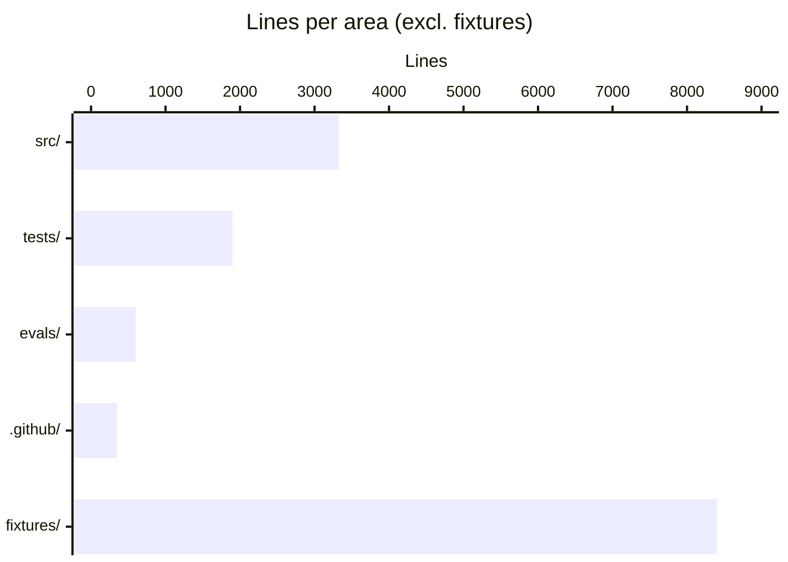

# By the numbers

A quantitative snapshot of the codebase.

Data collected on 2026-05-08.

## Size

The whole project is about 22,490 lines including test fixtures. Excluding fixtures and Markdown docs, the source is around 3,400 lines of Python.

| Area | Lines | Files |
|------|-------|-------|
| `src/anthropic_news_mcp/` | ~3,325 | 16 |
| `src/anthropic_news_mcp/fetchers/` | ~1,194 | 10 |
| `tests/` (excl. fixtures) | ~1,900 | 11 |
| `tests/fixtures/` (frozen HTTP responses) | ~8,400 | 19 |
| `evals/` | ~600 | 4 |
| `.github/` | ~350 | 9 |

The largest source files:

| File | Lines | Purpose |
|------|-------|---------|
| `src/anthropic_news_mcp/cache.py` | 842 | SQLite schema + accessors + FTS5 |
| `src/anthropic_news_mcp/server.py` | 761 | All tool, resource, prompt definitions |
| `src/anthropic_news_mcp/fetchers/official.py` | 638 | Shared parsers + 9 official-Anthropic fetchers |
| `src/anthropic_news_mcp/research.py` | 460 | Evidence-first research subsystem |
| `src/anthropic_news_mcp/remote.py` | 308 | OIDC JWT verifier + Starlette middleware |
| `src/anthropic_news_mcp/retrieval.py` | 225 | Aggregation, dedup, error sanitization |
| `src/anthropic_news_mcp/audit.py` | 187 | Live source-health audit CLI |
| `src/anthropic_news_mcp/models.py` | 180 | Pydantic models + enums |
| `src/anthropic_news_mcp/content.py` | 163 | Page fetch + excerpt windowing |

The largest test files:

| File | Lines |
|------|-------|
| `tests/test_cache.py` | 567 |
| `tests/test_server.py` | 572 |
| `tests/test_remote.py` | 256 |
| `tests/test_retrieval.py` | ~280 |

## Activity

The repository is brand new and was developed in a tight burst of commits.

| Metric | Value |
|--------|-------|
| Total commits | 27 |
| First commit | 2026-05-07 23:16 +0900 |
| Latest commit | 2026-05-08 17:50 +0900 |
| Active development span | ~19 hours |
| Commits per day | ~13.5 (during active span) |

The largest commits by lines changed (insertions + deletions):

| Commit | Subject | Insertions | Deletions |
|--------|---------|------------|-----------|
| `a88c8ec` | feat: fetcher base + newsroom + docs (CC + API) | 7,511 | 0 |
| `cb82ade` | feat: GitHub releases + org events fetchers | 2,874 | 0 |
| `b7e297a` | Add evidence-first research tools | 2,370 | 63 |
| `cfae3c6` | Expand Anthropic source coverage | 1,585 | 121 |
| `409fd84` | Enhance evaluation capabilities and improve documentation | 1,403 | 301 |
| `09b1c26` | Add MCP quality report and remote hardening | 1,079 | 76 |

The fetcher and fixture commits dominate — capturing live HTML responses and freezing them as fixtures accounts for most of the early line-count weight.

Churn hotspots (files most changed since `a88c8ec`):

- `src/anthropic_news_mcp/server.py` — added in `42c7e6e`, expanded by `b7e297a`, `09b1c26`, `7f769e1`
- `src/anthropic_news_mcp/cache.py` — added in `34fe76f`, expanded by `8ce66f0`, `b7e297a`, `cdeee1a`
- `src/anthropic_news_mcp/fetchers/official.py` — added in `a88c8ec`, expanded by `cfae3c6`

## Bot-attributed commits

The git trailers show frequent `Co-Authored-By: Claude Sonnet 4.6 <noreply@anthropic.com>` lines. Counting commits with that trailer:

| Bucket | Count |
|--------|-------|
| Commits with `Co-Authored-By: Claude` trailer | majority of commits |
| Commits authored by humans only | minority |

The repository was developed primarily through AI-assisted coding (the project's `CLAUDE.md` exists specifically to guide Claude Code) so this is expected. This metric is a lower bound on AI involvement — inline AI tooling like Copilot leaves no git trace.

## Tools, sources, and tests

| Metric | Value |
|--------|-------|
| MCP tools | 15 |
| MCP resources | 7 |
| MCP prompts | 6 |
| Configured sources | 17 |
| Pytest tests | 146+ (per `tests/test_server.py::test_list_sources_returns_all` plus all parser tests) |
| Frozen HTTP fixtures | 19 |
| Source modules in `src/anthropic_news_mcp/` | 13 (excl. `__init__`, `__main__`, `py.typed`) |
| Fetcher modules in `src/anthropic_news_mcp/fetchers/` | 10 (excl. `__init__`, `base.py`) |

## Test-to-code ratio

Approximate ratio per system, by source line count:

| System | Source lines | Test lines | Ratio |
|--------|--------------|------------|-------|
| Cache | 842 | 567 | 0.67 |
| Server (tool surface) | 761 | 572 | 0.75 |
| Fetchers (all) | ~1,194 | ~700 (across `test_fetchers/`) | ~0.59 |
| Retrieval | 225 | ~280 | ~1.24 |
| Remote ASGI | 308 | 256 | 0.83 |

The retrieval layer is the most heavily tested by ratio because dedup, error handling, and concurrent fetch are the trickiest paths.

## Dependencies

| Group | Count | Examples |
|-------|-------|----------|
| Required | 4 | `mcp>=1.27`, `httpx>=0.27`, `selectolax>=0.3.21`, `pydantic>=2.7` |
| Eval extra | 2 | `anthropic>=0.40`, `PyYAML>=6.0` |
| Remote extra | 3 | `PyJWT[crypto]>=2.8`, `starlette>=0.37`, `uvicorn>=0.30` |
| Dev extra | 5 | `pytest>=8.2`, `pytest-asyncio>=0.23`, `mypy>=1.10`, `ruff>=0.4`, `pre-commit>=3.7` |

Total third-party packages installed in a fresh `[dev]` venv: in the dozens (transitive). The runtime dependency surface is intentionally small — four packages, all popular and actively maintained.
