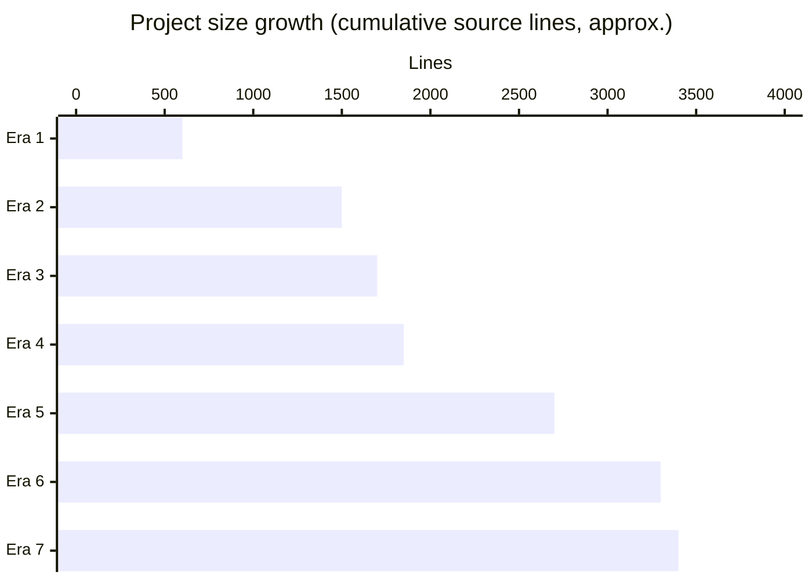

# Lore

The codebase is brand new. Every commit lives within a 19-hour window on May 7–8, 2026. The story below is therefore short — but it has clear phases.

Author throughout: KeigoShimadaCC, with frequent `Co-Authored-By: Claude Sonnet 4.6` trailers indicating AI-assisted development.

## Eras

### Era 1: Scaffolding and core data model (May 7, 2026, ~23:16–23:20 +0900)

The repo started with the project scaffold (`58898d2`) — `pyproject.toml`, `LICENSE`, `.gitignore`, basic structure. Three minutes later, `34fe76f` added the data model and SQLite cache: `NewsItem`, `SourceConfig`, `cache.py` with the table layout that survives mostly intact today.

This era set the structural decisions everything else builds on:

- One Python package in `src/`
- Pydantic v2 for models
- SQLite WAL for the cache
- A clear separation between cache, retrieval, and fetchers

### Era 2: Fetcher buildout (May 7, 2026, 23:31–23:40 +0900)

Four feature commits in nine minutes brought the source coverage online:

- `a88c8ec` — fetcher base + newsroom + docs (CC + API). 7,511 lines. The single largest commit; most of the weight is fixtures.
- `cb82ade` — GitHub releases + org events fetchers. 2,874 lines.
- `7dd11e2` — HN + Reddit fetchers. 347 lines.
- `42c7e6e` — config + retrieval layer + the initial tool surface. 693 lines.

By the end of this era, the server was end-to-end functional: a client could call `get_recent_updates` and get items back from a dozen sources.

### Era 3: Eval harness and docs (May 8, 2026, 11:01–11:06 +0900)

A second sprint focused on evaluation and documentation:

- `ed9f3cd` — eval harness with 20 golden prompts.
- `3dea670` — full README with architecture, install, eval, and extension guide.
- `0bca189` — `CLAUDE.md` with commands and architecture guide for AI-assisted contributors.

This era introduced the LLM judge harness using `claude-haiku-4-5` and the rubric scoring 0–2 per dimension. The README still uses this scoring framework today.

### Era 4: Security hardening (May 8, 2026, 11:20–11:36 +0900)

Three security-focused commits in 16 minutes:

- `f3ce120` — fix LIKE wildcard injection in cache search; eval prompt injection via `<untrusted_data>` tags.
- `aa88603` — input validation, error handling, hygiene fixes.
- `cef77e9` — round 2: fault tolerance, validation, and dedup correctness.

These commits established the patterns documented in [Security](./security.md): error sanitization, host allowlist, validated source keys, escaped LIKE patterns, and structured error envelopes.

### Era 5: Source expansion (May 8, 2026, 12:14–13:01 +0900)

A burst of fetcher and quality-control work:

- `cfae3c6` — Expand Anthropic source coverage (engineering, economic index, business infrastructure, trust & policy, GitHub issues/PRs, system prompts docs, support release notes). 1,585 insertions.
- Several `fix:` commits tightening retrieval, cache, and lint.
- `09b1c26` — MCP quality report and remote hardening. The remote ASGI deployment with OIDC and rate limiting comes from this commit.

By the end of this era, the source registry had grown from ~7 to its current 17.

### Era 6: Evidence-first research (May 8, 2026, 15:05–15:24 +0900)

Three commits introduced the evidence model that powers the research, digest, timeline, and claim-evaluation tools:

- `b7e297a` — evidence-first research tools. 2,370 insertions including new `content.py`, expanded `research.py`, `EvidenceExcerpt`/`ContentDetail`/`DedupCluster` models.
- `2b55c17` — MCP research documentation update.
- `cdeee1a` — test coverage for new cache functions and server tools.

This era is the philosophical inflection point of the project: the server stopped being "fetch news" and became "fetch evidence the client can cite."

### Era 7: Polish (May 8, 2026, 15:46–17:50 +0900)

Two commits that didn't add features but tightened everything:

- `409fd84` — enhance evaluation capabilities; improve documentation; offline eval harness alongside the LLM eval; deterministic seed cache.
- `7f769e1` — enhance documentation and logging features. The most recent commit.

After Era 7, the project state is what this wiki describes.

## Longest-standing features

Despite the repo's age, a few decisions from Era 1 (May 7, 23:19) survive almost unchanged:

| Feature | Introduced | Status today |
|---------|-----------|--------------|
| `NewsItem` shape | `34fe76f` | Same fields, plus `source_type`, `evidence_tier`, `is_official` added in Era 5 |
| `SourceConfig` dataclass | `34fe76f` | Same shape, with `source_type` and `evidence_tier` added in Era 5 |
| SQLite WAL + per-source snapshot row | `34fe76f` | Same; tables added but never removed |
| `Fetcher` ABC | `a88c8ec` | Identical |

## Deprecated / removed features

A handful of dependencies and patterns came and went:

- `feedparser` and `respx` were added in early commits but removed in `19c38ff` — feedparser was never wired in (RSS feeds turned out to be unnecessary), and `respx` was replaced by direct fixture parsing in tests.

There are no other deprecated features. The codebase has been additive throughout.

## Major rewrites

None at the file level. The biggest restructure was Era 5's `cfae3c6` (1,585 insertions, 121 deletions) which mostly added rather than replaced. The cache module's batch-write optimizations in `8ce66f0` were the most invasive in-place change, and even those preserved every public API.

## Growth trajectory

The shape: a fast scaffolding, then a sustained build-out of fetchers, then security and source expansion, then a research-tooling pivot, then polish.

## Why the timeline is so compressed

`CLAUDE.md` and the frequent `Co-Authored-By: Claude Sonnet 4.6` trailers explain the velocity: the project was built primarily through AI-assisted development, with the human author driving design decisions and review. The commit cadence (27 commits in 19 hours) reflects an iterative loop between human direction and AI implementation rather than continuous human keystrokes.
