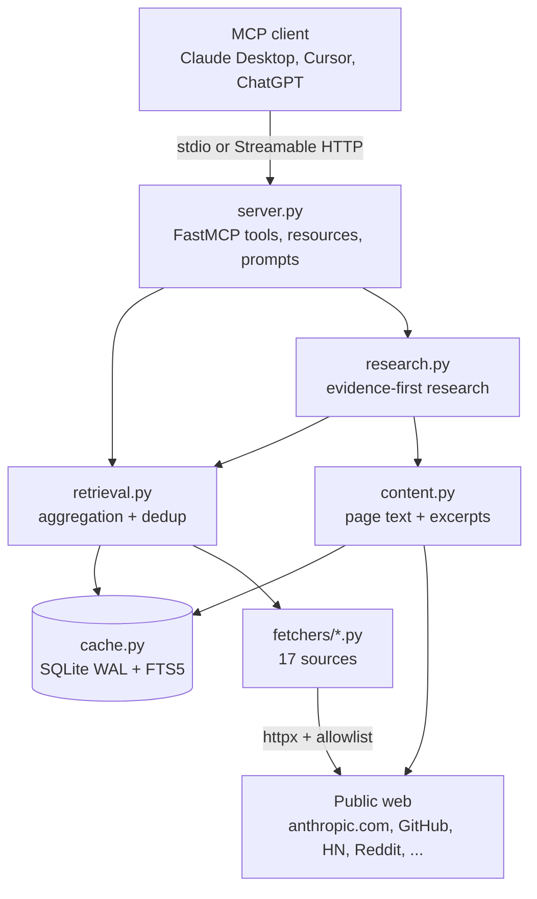
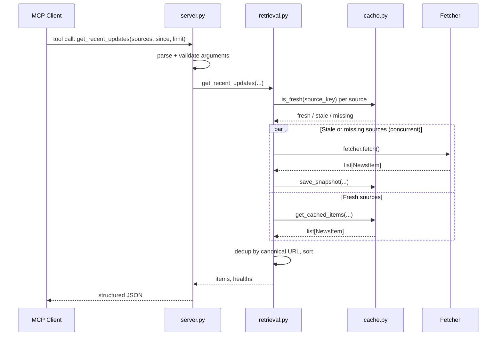

# Architecture

The server has a layered architecture. MCP clients call tool handlers in `server.py`. Handlers parse and validate arguments, then delegate to the retrieval and research layers, which read and write a SQLite cache. On cache miss, the retrieval layer fans out concurrent HTTP requests to source-specific fetchers.

## Component diagram

## Request lifecycle

A typical `get_recent_updates` call walks this path:

## Module map

| Module | Responsibility | Path |
|--------|---------------|------|
| `server` | FastMCP tool, resource, prompt definitions; argument parsing; error envelope | `src/anthropic_news_mcp/server.py` |
| `retrieval` | Concurrent fetch orchestration, URL canonicalization, trust-ranked dedup, error sanitization | `src/anthropic_news_mcp/retrieval.py` |
| `research` | Evidence excerpt management, topic timelines, dedup clusters, sessions, notes, reports, claim evaluation | `src/anthropic_news_mcp/research.py` |
| `content` | Full-page fetch, HTML/JSON normalization, excerpt windowing, content hashing | `src/anthropic_news_mcp/content.py` |
| `cache` | SQLite schema, snapshot/items/history/details/evidence/session tables, FTS5 search | `src/anthropic_news_mcp/cache.py` |
| `config` | `SourceConfig` dataclass and `SOURCE_REGISTRY` (one entry per source) | `src/anthropic_news_mcp/config.py` |
| `models` | Pydantic schemas: `NewsItem`, `SourceHealth`, `ContentDetail`, `EvidenceExcerpt`, sessions, claim results | `src/anthropic_news_mcp/models.py` |
| `http` | Shared async `httpx` client with response-host allowlist hook | `src/anthropic_news_mcp/http.py` |
| `audit` | Live source-health audit CLI (`anthropic-news-audit`) | `src/anthropic_news_mcp/audit.py` |
| `remote` | OIDC JWT verifier and Starlette middleware for Streamable HTTP deployment | `src/anthropic_news_mcp/remote.py` |
| `asgi` | Lazy ASGI entrypoint (`anthropic_news_mcp.asgi:app`) | `src/anthropic_news_mcp/asgi.py` |
| `fetchers/` | One module per source family (newsroom, official, docs, GitHub, HN, Reddit) | `src/anthropic_news_mcp/fetchers/` |

## Key design decisions

**Stateless fetchers.** Every fetcher subclass implements a single `async fetch() -> list[NewsItem]` method. Fetchers do no caching of their own and hold no state between calls; the retrieval layer is the sole owner of the cache. This makes fetchers trivial to unit-test against frozen fixtures and lets the retrieval layer treat each source uniformly.

**Per-source TTLs in a single registry.** `SOURCE_REGISTRY` in `src/anthropic_news_mcp/config.py` is the single source of truth for which sources exist, their TTLs, default categories, source type, and evidence tier. Adding a new source is two steps: write a fetcher class, add a registry entry.

**Trust-ranked dedup.** When the same URL appears from multiple sources, the retrieval layer keeps the representative whose `(source_type, evidence_tier, has_published_at, importance, summary_quality, registry_order)` tuple ranks highest. Official and docs sources outrank GitHub, which outranks community. See `_representative_key` in `src/anthropic_news_mcp/retrieval.py`.

**SQLite with WAL and FTS5.** A single SQLite file (`~/.cache/anthropic-news-mcp/cache.db` by default) holds eight tables: source snapshots, items, item history, content details, evidence excerpts, research sessions, notes, and reports, plus an `items_fts` virtual table for ranked search. `CACHE_SCHEMA_VERSION` triggers a drop-and-recreate on mismatch.

**Evidence-first research.** Detail, timeline, digest, and claim tools never call an LLM. They return structured evidence packages — items, normalized text, stable excerpts with content hashes, and dedup clusters — that the client model can cite. The server itself is purely retrieval and storage.

**Untrusted source model.** Fetched titles, summaries, authors, tags, and page text are returned as data only. The server-level instructions and individual tool prompts both warn clients not to follow instructions inside fetched content.

**Outbound host allowlist.** `src/anthropic_news_mcp/http.py` registers a response hook that rejects any host outside a fixed allowlist, preventing accidental exfiltration via redirects.

**Remote mode is resource-server only.** When deployed as Streamable HTTP, the server validates JWTs against an external OIDC issuer; it does not implement an authorization server itself. Startup fails unless issuer, audience, allowed hosts, and allowed origins are all set.

## Data flow for a typical session

A research workflow chains several tools:

1. `get_recent_updates` populates the cache.
2. `get_update_detail` fetches a specific item's full page text, normalizes it, and stores stable excerpts.
3. `get_timeline` runs `search_web_sources` over cached items, groups by date, and builds dedup clusters.
4. `build_digest_context` packages the timeline as citation-ready evidence for the client model to write prose from.
5. `create_research_session` and `save_research_note` / `save_research_report` persist work locally.
6. `evaluate_claims` deterministically matches claim terms to stored evidence.

See [API tools](../api/tools.md) for the full surface and [Research system](../systems/research.md) for the evidence model.
