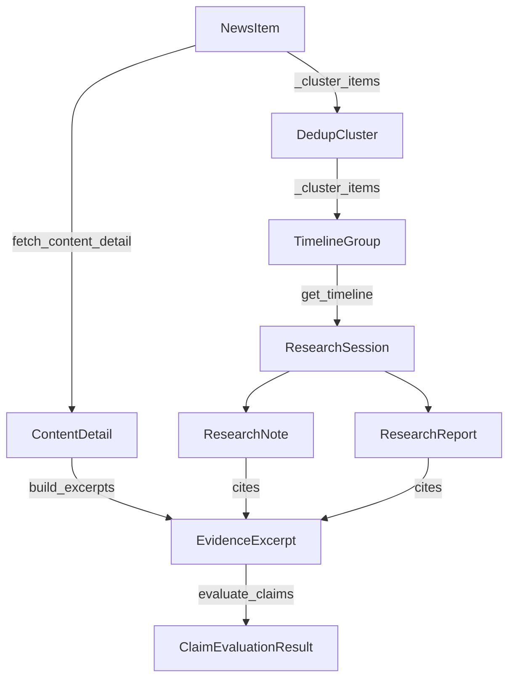

# Evidence types

The research subsystem introduces six types beyond `NewsItem`. They model the evidence package that flows from a fetched page through normalization, excerpting, clustering, and finally session-bound notes and reports.

All defined in `src/anthropic_news_mcp/models.py`.

## `ContentDetail`

```python
class ContentDetail(BaseModel):
    item_id: str
    url: HttpUrl
    normalized_text: str
    retrieved_at: datetime
    content_hash: str
    content_type: str
    truncated: bool = False
    warnings: list[str] = []
```

The full normalized page text for one `NewsItem`. `content_hash` is SHA-256 of the UTF-8 encoded text. `warnings` accumulates messages from `content.fetch_content_detail` (truncation, oversized response, fall-back to title+summary, unsupported content type).

Persisted in the `content_details` table. One detail per item — re-fetching overwrites.

## `EvidenceExcerpt`

```python
class EvidenceExcerpt(BaseModel):
    evidence_id: str
    item_id: str
    url: HttpUrl
    title: str
    source_key: str
    source_type: SourceType
    evidence_tier: EvidenceTier
    text: str
    start_char: int
    end_char: int
    retrieved_at: datetime
    content_hash: str
```

A stable text window inside a `ContentDetail`. `evidence_id` is content-addressed:

```python
seed = f"{item.id}:{detail.content_hash}:{start}:{end}"
evidence_id = sha256(seed).hexdigest()
```

Two excerpts with the same item ID, content hash, and offsets get the same evidence ID. When the page changes (and the hash with it), new excerpts are minted with new IDs.

`source_type` and `evidence_tier` are denormalized in for fast lookup — clients can show provenance without a join.

Persisted in `evidence_excerpts`.

## `DedupCluster`

```python
class DedupCluster(BaseModel):
    cluster_id: str
    representative_item_id: str
    item_ids: list[str]
    canonical_url: str
    evidence_tier: EvidenceTier
```

Built ephemerally inside `get_timeline`'s `_cluster_items`. Groups items that share a canonical URL on a given day, picks the one with the highest evidence tier as the representative. `cluster_id` is `sha256(canonical_url + sorted(item_ids))` so clusters are stable across runs.

Not persisted. Generated fresh per timeline call.

## `TimelineGroup`

```python
class TimelineGroup(BaseModel):
    date: str   # ISO date "YYYY-MM-DD"
    items: list[NewsItem]
    clusters: list[DedupCluster] = []
```

One day's worth of timeline data: every item that landed on that date, plus the dedup clusters covering them.

Not persisted. Generated fresh per timeline call.

## `ResearchSession`

```python
class ResearchSession(BaseModel):
    session_id: str
    title: str
    topic: str | None = None
    filters: dict[str, object] = {}
    created_at: datetime
    updated_at: datetime
```

A user-created research workspace. `filters` is opaque to the server — clients can store any structured filter set they want to associate with the session. `updated_at` is bumped automatically when notes or reports are added.

Persisted in `research_sessions`.

## `ResearchNote`

```python
class ResearchNote(BaseModel):
    note_id: str
    session_id: str
    text: str
    evidence_ids: list[str] = []
    follow_up: bool = False
    created_at: datetime
```

A note attached to a session. `evidence_ids` references one or more `EvidenceExcerpt.evidence_id` values. `follow_up=True` flags the note as an open question rather than a finding — clients can render these as a separate to-do list.

Persisted in `research_notes`.

## `ResearchReport`

```python
class ResearchReport(BaseModel):
    report_id: str
    session_id: str
    title: str
    markdown: str
    evidence_ids: list[str] = []
    created_at: datetime
```

A model-generated digest or summary stored against a session. `markdown` is the rendered prose; the server doesn't render or interpret it. `evidence_ids` is the citation list that supports the report.

Persisted in `research_reports`.

## `ClaimEvaluationResult`

```python
class ClaimEvaluationResult(BaseModel):
    claim: str
    support: ClaimSupport
    evidence: list[EvidenceExcerpt] = []
    reason: str
```

Output of `evaluate_claims`. `support` is `strong_support`, `weak_support`, `unsupported`, or `needs_review`. `evidence` is the ranked list of excerpts that scored highest for the claim. `reason` is a deterministic English explanation of why the support label was chosen.

Not persisted — recomputed per call.

## How they compose



## Persistence summary

| Type | Persisted? | Table |
|------|------------|-------|
| `ContentDetail` | yes | `content_details` |
| `EvidenceExcerpt` | yes | `evidence_excerpts` |
| `ResearchSession` | yes | `research_sessions` |
| `ResearchNote` | yes | `research_notes` |
| `ResearchReport` | yes | `research_reports` |
| `DedupCluster` | no | (computed per call) |
| `TimelineGroup` | no | (computed per call) |
| `ClaimEvaluationResult` | no | (computed per call) |

## Key source files

| File | Purpose |
|------|---------|
| `src/anthropic_news_mcp/models.py` | All evidence types |
| `src/anthropic_news_mcp/research.py` | Logic that produces them |
| `src/anthropic_news_mcp/cache.py` | Persistence accessors for the persisted types |
