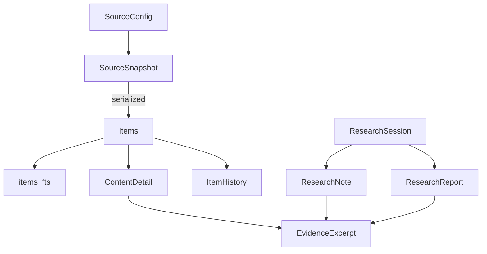

# Cache

The cache is a single SQLite database in WAL mode that stores per-source snapshots, individual items, content details, evidence excerpts, item history, and research session state. It also exposes ranked full-text search over items via FTS5.

## Purpose

Be the single source of truth for everything the retrieval and research layers persist locally. Survive restarts. Support concurrent reads from one server instance. Be trivial to swap to a temporary path during tests.

## Database location

The default path is `~/.cache/anthropic-news-mcp/cache.db`. Resolution order in `get_db_path()` (`src/anthropic_news_mcp/cache.py`):

1. `_DB_PATH` set programmatically via `set_db_path(...)` (used by tests).
2. `ANTHROPIC_NEWS_MCP_CACHE_DB` env var, must be an absolute path.
3. `XDG_CACHE_HOME/anthropic-news-mcp/cache.db` if `XDG_CACHE_HOME` is set.
4. `~/.cache/anthropic-news-mcp/cache.db`.

If the resolved cache directory has world-readable permissions (`stat & 0o007`), `get_db_path()` emits a warning. Tests that exercise this path live in `tests/test_cache.py::TestDbPath`.

## Schema

`CACHE_SCHEMA_VERSION = 3`. On init, if the stored version is higher than the running code's version, init raises. If lower, the schema is recreated from scratch. The full DDL lives in `init_db()`:

| Table | Purpose | Key |
|-------|---------|-----|
| `schema_version` | Tracks current schema version (single row) | `version` |
| `source_snapshots` | One row per source with serialized items JSON, fetched/expires timestamps, status, error | `source_key` |
| `items` | Per-item rows for ranked search and direct lookup | `id` |
| `items_fts` (virtual) | FTS5 index over title, summary, tags, source key, source type, evidence tier | implicit |
| `content_details` | Full normalized page text per item with content hash | `item_id` |
| `evidence_excerpts` | Stable text windows inside content details | `evidence_id` |
| `item_history` | First-seen / last-seen / last-changed timestamps for `compare_updates` | `id` |
| `research_sessions` | Research session metadata | `session_id` |
| `research_notes` | Notes attached to a session | `note_id` |
| `research_reports` | Reports attached to a session | `report_id` |

Indexes cover the lookups used in hot paths: `idx_items_source`, `idx_items_published`, `idx_details_hash`, `idx_evidence_item`, `idx_history_item`, `idx_notes_session`, `idx_reports_session`.

## Entity relationship sketch



Items are stored twice on purpose: as a single JSON blob in `source_snapshots.items_json` (for fast bulk reads in retrieval) and as individual rows in `items` (for ranked search and direct lookup by ID).

## Key public functions

### Snapshot management

| Function | Purpose |
|----------|---------|
| `init_db()` | Idempotent schema setup. Called by every public function. |
| `save_snapshot(source_key, items, ttl_seconds, status, error)` | Persist a fetch result. Updates snapshot, items, items_fts, and item_history in one transaction. |
| `get_snapshot(source_key)` | Returns the `SourceHealth` row for a source. |
| `is_fresh(source_key)` | True if the snapshot exists and `expires_at > now`. |
| `get_cached_items(source_key)` | Returns the deserialized items for one source. |
| `get_all_snapshots()` | Returns all source health records. |

### Item lookup and search

| Function | Purpose |
|----------|---------|
| `get_item(item_id)` | Single item by ID. |
| `get_all_items()` | All items, newest first. |
| `search_items(query, limit)` | Ranked FTS5 search with BM25 weights `(title=4.0, summary=2.5, tags=1.5, source_key=1.0, source_type=0.5, evidence_tier=0.5)`. Falls back to a `LIKE` scan if the FTS5 module is unavailable. |
| `_literal_search_items(query, limit)` | Literal `LIKE` scan over `items.payload_json`, used as the FTS5 fallback. |

### Content and evidence

| Function | Purpose |
|----------|---------|
| `save_content_detail(detail)` | Persist normalized full-page text. |
| `get_content_detail(item_id)` | Lookup. |
| `get_all_content_details()` | Bulk preload to avoid per-item DB round-trips in `search_web_sources`. |
| `save_evidence_excerpts(excerpts)` | Bulk insert. |
| `get_evidence(evidence_id)`, `get_evidence_many(ids)`, `get_evidence_for_item(item_id)` | Lookups. |
| `search_details(query, limit)` | Literal `LIKE` over normalized text. |

### Research session state

| Function | Purpose |
|----------|---------|
| `save_research_session(session)` / `get_research_session(session_id)` | Session CRUD. |
| `save_research_note(note)` / `get_research_notes(session_id)` | Notes. |
| `save_research_report(report)` / `get_research_reports(session_id)` | Reports. |
| `get_item_history_since(since, limit)` | Used by `compare_updates`. |

## How `save_snapshot` mutates state

`save_snapshot` is the most complex write path. It runs inside one connection's transaction:

1. `INSERT OR REPLACE` into `source_snapshots` with the serialized items JSON.
2. Compare current item IDs to existing rows for the source. For items that disappeared, `INSERT OR REPLACE` into `item_history` with their last-seen timestamp.
3. `DELETE` then re-`INSERT OR REPLACE` rows in `items` for the source.
4. Rebuild `items_fts` rows for the source (delete + re-insert).
5. Batch-fetch existing history rows and content hashes for the new item set.
6. For each new item, decide whether the content hash changed and update `item_history` accordingly.
7. `commit`.

The batch fetches in step 5 are a deliberate optimization — earlier versions did per-item lookups inside the loop and blew up on large source dumps.

## Test isolation

`tests/test_cache.py` and `tests/test_server.py` use an `autouse` fixture:

```python
@pytest.fixture(autouse=True)
def isolated_db(tmp_path: Path) -> None:
    cache_mod.set_db_path(tmp_path / "test.db")
    yield
    cache_mod.set_db_path(None)
```

Every test gets a fresh database. Production code never calls `set_db_path`.

## Schema migrations

There is no migration framework. `CACHE_SCHEMA_VERSION` is bumped manually when tables change, and `init_db()` recreates the schema when the stored version is lower. This works because the cache is by definition disposable — losing it just forces a full refetch on next call.

When you make a schema change:

1. Bump `CACHE_SCHEMA_VERSION`.
2. Add the new table or column to `init_db()`.
3. Add tests that exercise the new shape against a `tmp_path` database.
4. Avoid changing existing column types — drop and recreate is the supported path.

## Integration points

- **Read by:** `retrieval.get_recent_updates`, `retrieval.search_updates`, `retrieval.get_health`, every research function in `research.py`, every resource handler in `server.py`.
- **Written by:** `retrieval._fetch_source` (`save_snapshot`), `research.get_update_detail` (`save_content_detail`, `save_evidence_excerpts`), session/note/report tool handlers in `server.py`.

## Key source files

| File | Purpose |
|------|---------|
| `src/anthropic_news_mcp/cache.py` | Schema, queries, FTS5 wiring (~840 lines) |
| `tests/test_cache.py` | Schema, write path, search, history, evidence, session tests |

## Entry points for modification

- To add a new persisted entity (e.g. a follow-up tracking table): add the `CREATE TABLE`, indexes, and accessor functions in `cache.py`, then bump `CACHE_SCHEMA_VERSION`.
- To change FTS5 weighting: edit the `bm25(items_fts, ...)` call in `search_items`.
- To support multi-instance shared storage: replace SQLite with a network store. The README marks this as future work; nothing else in the codebase depends on SQLite-specific features beyond the FTS5 extension.
