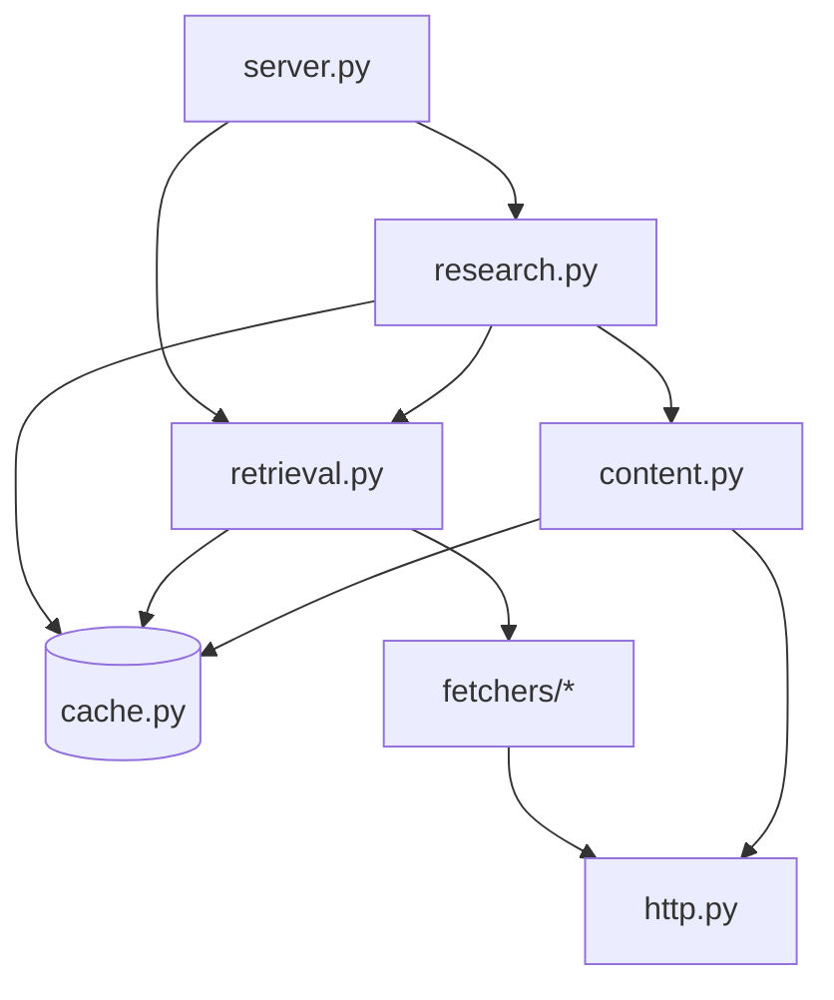

# Systems

The server breaks into five internal subsystems that sit between the MCP tool layer and the SQLite cache.

| System | What it owns | File |
|--------|--------------|------|
| [Retrieval](./retrieval.md) | Concurrent fetch orchestration, URL canonicalization, trust-ranked dedup | `src/anthropic_news_mcp/retrieval.py` |
| [Cache](./cache.md) | SQLite schema, snapshot/items/history/details/evidence/session tables, FTS5 search | `src/anthropic_news_mcp/cache.py` |
| [Fetchers](./fetchers.md) | The `Fetcher` ABC, per-source HTTP clients, the shared `httpx` client and host allowlist | `src/anthropic_news_mcp/fetchers/`, `src/anthropic_news_mcp/http.py` |
| [Research](./research.md) | Evidence excerpts, topic timelines, dedup clusters, sessions, notes, reports, claim evaluation | `src/anthropic_news_mcp/research.py` |
| [Content](./content.md) | Full-page fetch, HTML/JSON normalization, excerpt windowing, content hashing | `src/anthropic_news_mcp/content.py` |

The MCP tool layer in `src/anthropic_news_mcp/server.py` is a thin shell over these subsystems. It validates arguments, dispatches to retrieval or research, and serializes Pydantic models. Everything else lives below.

## How the systems compose

The retrieval layer is the only path to the fetchers. Research can read directly from the cache and call `content.fetch_content_detail` for individual items, but for bulk source aggregation it goes through `retrieval.get_recent_updates`.
