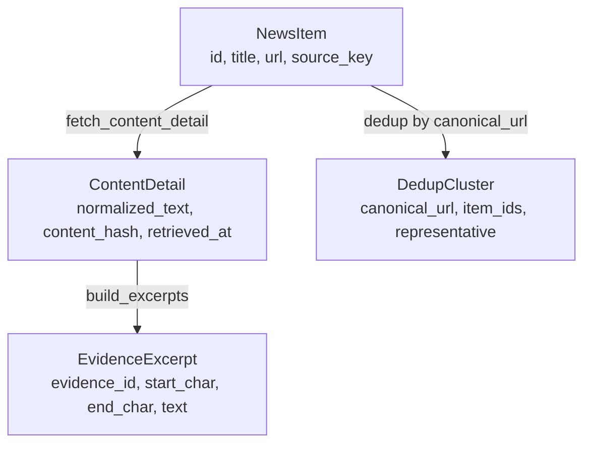
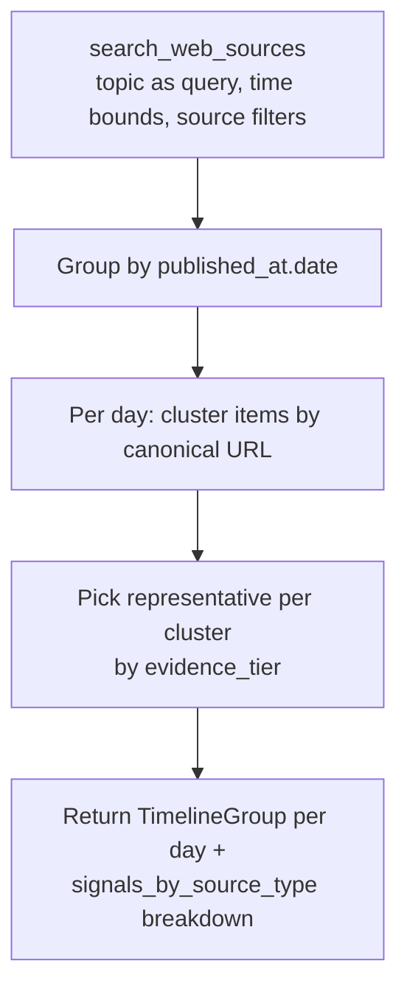
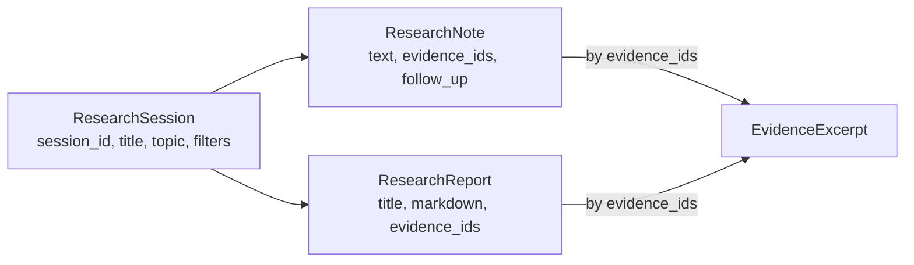

# Research

The research subsystem layers evidence-first workflows on top of the retrieval and cache layers. Detail, timeline, digest, and claim-evaluation tools all return structured evidence packages — items, normalized text, stable excerpts with content hashes — instead of generated prose. The server itself never calls an LLM.

## Purpose

Give a client model the raw material it needs to write a citable digest, build a topic timeline, or verify a claim. The research layer owns the evidence model: how page text is fetched, how excerpts are derived and stored, how items are deduped into clusters by canonical URL, and how claims are matched against stored evidence.

## Public surface

| Function | What it does | MCP tool |
|----------|--------------|----------|
| `get_update_detail(item_id, refresh, max_chars, excerpt_query)` | Returns one item with normalized full-page text, evidence excerpts, content hash, and provenance | `get_update_detail` |
| `search_web_sources(query, sources, categories, source_types, importance, tags, since, until, limit, refresh)` | Filtered search across cached items with optional refresh of full content | `search_web_sources` |
| `get_timeline(topic, since, until, sources, categories, source_types, limit)` | Builds a chronological topic timeline grouped by date with dedup clusters | `get_timeline` |
| `compare_updates(since, limit)` | Diffs cached items against history: new, changed, disappeared | `compare_updates` |
| `build_digest_context(topic, since, until, categories, sources, limit)` | Wraps `get_timeline` with digest-writing instructions for the client model | `build_digest_context` |
| `create_research_session`, `save_research_note`, `save_research_report`, `get_research_session` | Local research session state | matching tool names |
| `evaluate_claims(claims, evidence_ids, session_id, query, limit)` | Deterministic term-overlap match between claims and evidence excerpts | `evaluate_claims` |

All of these live in `src/anthropic_news_mcp/research.py`.

## The evidence model

`ContentDetail` is the normalized text of a fetched page. `EvidenceExcerpt` is a stable text window inside that detail, identified by SHA-256 of `(item_id, content_hash, start_char, end_char)`. Excerpts survive content changes only when the underlying text doesn't change — when a page is re-fetched and its hash differs, new excerpts are created.

## How `get_update_detail` works

1. Look up the item in the cache. If missing, warm the cache via `retrieval.get_recent_updates(limit=100)` and look again.
2. If `refresh=True` or no `ContentDetail` exists, call `content.fetch_content_detail(item)` to fetch and normalize the page text. Save it.
3. Build evidence excerpts via `content.build_excerpts(...)` — one window per matched query term up to `max_excerpts=3`, falling back to the leading 900 characters when no query matches.
4. Save the excerpts.
5. Return `{item, detail (truncated to max_chars), excerpts, provenance}`.

The `provenance` block carries `source_key`, `source_type`, `evidence_tier`, and `url` so the client model can cite consistently.

## How `search_web_sources` works

1. Warm the cache for the requested sources / categories / since.
2. Pull all cached items.
3. If `refresh=True`, fan out concurrent `fetch_content_detail` calls (up to 5 in parallel via `asyncio.Semaphore(5)`) for the first 20 items missing details.
4. Pre-load every cached `ContentDetail` in one query to avoid per-item DB round-trips.
5. Apply `_matches_filters(...)`: source/category/source-type/importance/tag/time/title-summary-tags-text matches. The query falls through to the preloaded content text only if the title/summary/tags don't already contain it.
6. Take the first `limit` matches.
7. For the first 10 matches, build excerpts from any cached detail and store them.
8. Return items plus all excerpts.

## How `get_timeline` works

The `_cluster_items` helper canonicalizes URLs across the day's items, builds groups, and picks the representative whose source key has the highest evidence tier. Cluster IDs are SHA-256 hashes of `canonical_url + sorted(item_ids)` so they're stable across runs.

The output also includes `signals_by_source_type` — a flat breakdown of items per `SourceType` so the client can keep official, docs, GitHub, and community signals separated in the digest it writes.

## How `compare_updates` works

The cache's `item_history` table tracks `first_seen_at`, `last_seen_at`, `last_changed_at`, and `content_hash` for every item the cache has ever seen. `compare_updates`:

- Reads history rows where either `first_seen_at >= since` or `last_changed_at >= since`.
- For each row, looks up the current item in the cache. If absent → `disappeared`. If present and `first_seen_at == last_changed_at` → `new`. Otherwise → `changed`.

This is what powers "what's new since I last looked?" without storing a full snapshot of every prior fetch.

## How `evaluate_claims` works

Strictly deterministic — no LLM call:

1. Gather candidate evidence: explicit `evidence_ids`, plus session-linked evidence, plus a fallback `query` that searches `content_details` literal text.
2. For each claim, build a term set: lowercased words of length ≥4 from the claim text.
3. For each evidence excerpt, score = number of claim terms present in the excerpt's lowercased text.
4. Sort excerpts by score, take top `limit`.
5. Decide support label:
   - No claim terms → `needs_review`.
   - Top score ≥ `max(2, len(terms) // 2)` → `strong_support`.
   - Some matches but below threshold → `weak_support`.
   - No matches → `unsupported`.

This is intentionally simple — the goal is to give the client model an honest baseline ("these excerpts share these terms with your claim") rather than a confident verdict.

## Research sessions

Session state is local to the SQLite cache. The shape:

`get_research_session(session_id)` returns the session, all its notes and reports, and the union of every evidence excerpt those notes and reports cite. The session's `updated_at` is bumped whenever a note or report is added.

## Source metadata helper

`source_metadata(source_key)` looks up the source's `(SourceType, EvidenceTier)` from `SOURCE_REGISTRY`. Used by `_matches_filters`, `_cluster_items`, and `get_update_detail`. When the registry doesn't contain a key (legacy items in the cache), it falls back to `(OFFICIAL, HIGH)`.

## Integration points

- **Inputs:** Tool handlers in `server.py` after Pydantic validation.
- **Reads from:** `cache` (items, content details, evidence, history, sessions, notes, reports), `retrieval.get_recent_updates`, `retrieval._canonicalize_url`.
- **Writes to:** `cache.save_content_detail`, `cache.save_evidence_excerpts`, `cache.save_research_session`, `cache.save_research_note`, `cache.save_research_report`.
- **Calls:** `content.fetch_content_detail`, `content.build_excerpts`.

## Key source files

| File | Purpose |
|------|---------|
| `src/anthropic_news_mcp/research.py` | Whole research surface (~460 lines) |
| `src/anthropic_news_mcp/content.py` | Page fetch and excerpt windowing |
| `src/anthropic_news_mcp/cache.py` | Persistence layer for details, excerpts, sessions |

## Entry points for modification

- To return more / fewer excerpts per item: change `max_excerpts` in `content.build_excerpts` calls.
- To change the claim-support thresholds: edit the support-label decision in `evaluate_claims`.
- To add a new evidence-producing tool: add a function in `research.py`, wire a tool handler in `server.py`, and reuse `cache.save_evidence_excerpts` so the new evidence is queryable like any other.
- To support cross-day clustering in timelines: change `_cluster_items` to be called over the full item set instead of per-day.
