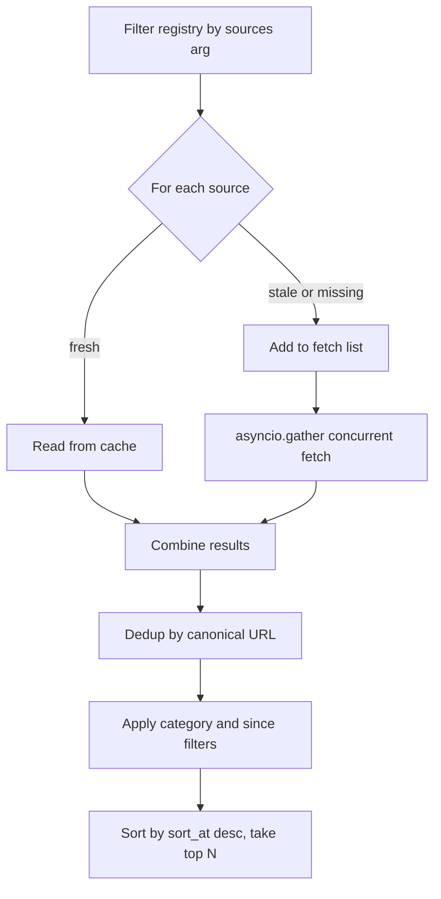
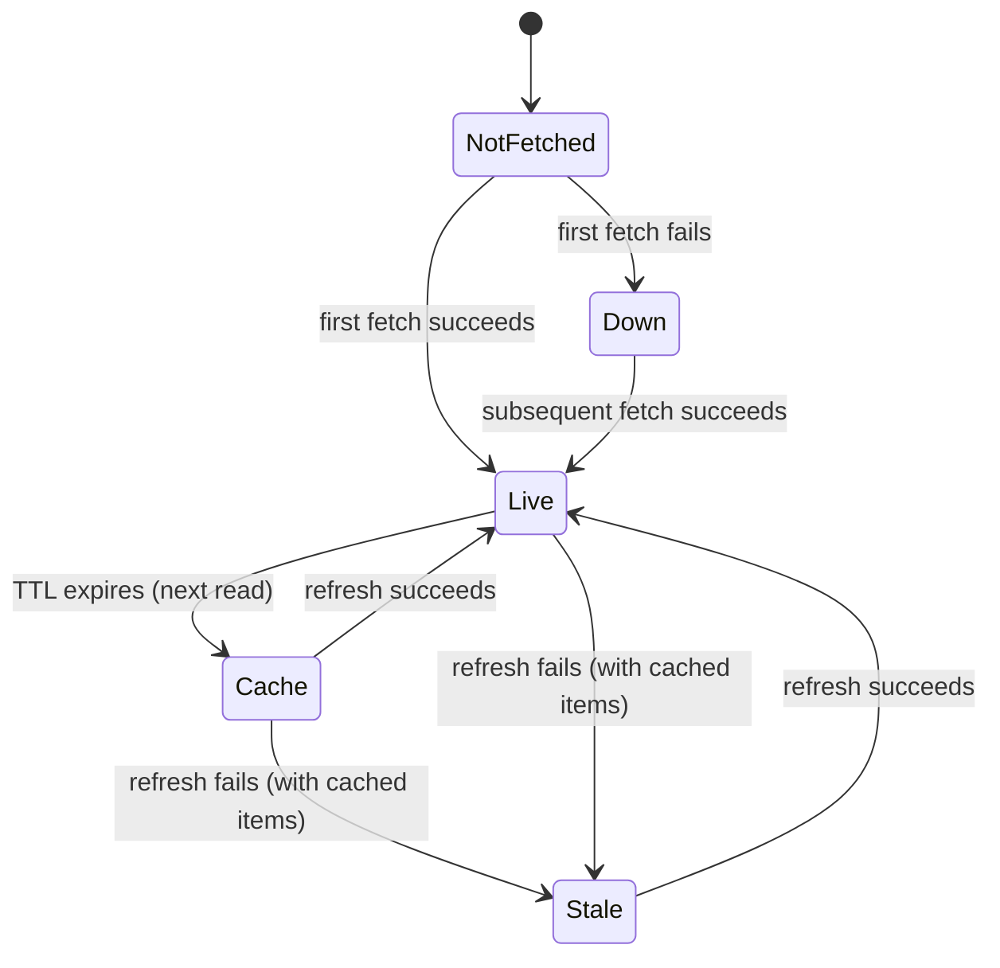

# Retrieval

The retrieval layer is the orchestration core. It decides which sources to refresh, fans out concurrent fetches, deduplicates results across sources, applies user filters, and returns a sorted list of items plus per-source health.

## Purpose

Given a set of source filters, time bounds, and a limit, return the top-N most recent items across all configured sources. Use cached data when fresh; refresh stale or missing sources concurrently; never let one broken source block the others.

## Public surface

| Function | What it does |
|----------|--------------|
| `get_recent_updates(sources, categories, since, limit)` | Aggregates items across sources with per-source TTL handling |
| `search_updates(query, limit)` | Searches the local cache; warms the cache first if cold |
| `get_health()` | Returns health for every configured source (uses placeholders for unfetched sources) |

All three live in `src/anthropic_news_mcp/retrieval.py`.

## How `get_recent_updates` works



1. Filter `SOURCE_REGISTRY` by the `sources` argument and drop disabled sources.
2. For each remaining source, ask the cache `is_fresh(source.key)`.
3. Stale or missing sources go into `targets_stale` and are fetched concurrently via `asyncio.gather(..., return_exceptions=True)`. Fresh sources go into `targets_fresh` and are pulled from the cache directly.
4. Each fetch returns `(items, health)`. Failures are converted by `_fetch_source` into a `STALE` (cached items present) or `DOWN` (no cached items) health record with a sanitized error message — the call still completes successfully.
5. All items are merged into a `dict[canonical_url, NewsItem]` keyed by `_canonicalize_url(item.url)`. When two items collide, the one with the higher `_representative_key` wins.
6. Optional category and `since` filters are applied to the merged set.
7. The list is sorted descending by `sort_at` (or `published_at`, or `discovered_at`) and trimmed to `limit`.

## URL canonicalization

`_canonicalize_url(url)`:

- Drops the URL fragment (`#section`).
- Strips query parameters whose name matches `utm_[a-z_]+`.
- Decodes percent-encoded keys and values.
- Sorts the remaining params by key.

This means `https://example.com/x?utm_source=foo&b=1&a=2#frag` and `https://example.com/x?a=2&b=1` both reduce to `https://example.com/x?a=2&b=1` and dedupe together.

## Trust-ranked dedup

The representative key is a six-tuple compared lexicographically:

```python
def _representative_key(item: NewsItem) -> tuple[int, int, int, int, int, int]:
    return (
        _source_rank(item),          # OFFICIAL=4, DOCS=3, GITHUB=2, COMMUNITY=1
        _tier_rank(item),            # HIGH=3, MEDIUM=2, LOW=1
        1 if item.published_at else 0,
        item.importance,             # 1..3
        min(len(item.summary.strip()), 400),
        -registry_order,             # earlier in SOURCE_REGISTRY wins ties
    )
```

The order — provenance, then evidence quality, then date confidence, then importance, then summary length, then registry order — encodes the project's editorial decisions. Adding a new source at a specific position in `SOURCE_REGISTRY` is the right way to influence tie-breaking.

## Error sanitization

`_sanitize_error(exc)` redacts secrets before they're stored in source health rows or logs:

- Replaces any query string with `?[redacted]`.
- Replaces `Authorization: Bearer ...` with `Authorization: Bearer [redacted]`.
- Replaces `api_key=`, `access_token=`, `password=`, etc. with `<key>=[redacted]`.
- Truncates the result to 200 characters.

The regex set lives in `_SECRET_VALUE_RE` at the top of the file — extend it if you encounter a new credential shape.

## Cache fresh / stale flow



The status field on `SourceHealth` tracks where in this state machine each source is. The retrieval layer rewrites `LIVE` to `CACHE` when serving a fresh row without re-fetching, so the client can tell whether the data was just refreshed or is being served from a TTL window.

## Integration points

- **Inputs:** Pydantic-validated arguments from `server.py` tool handlers.
- **Calls:** `cache.is_fresh`, `cache.get_cached_items`, `cache.save_snapshot`, `cache.get_snapshot`, `cache.get_all_snapshots`, `cache.search_items`, plus each fetcher's `fetch()`.
- **Used by:** `server.get_recent_updates`, `server.search_updates`, `server.get_source_health`, `research.search_web_sources`, `research.get_timeline`.

## Key source files

| File | Purpose |
|------|---------|
| `src/anthropic_news_mcp/retrieval.py` | The whole retrieval layer in ~225 lines |
| `src/anthropic_news_mcp/config.py` | `SOURCE_REGISTRY` consumed by retrieval |
| `src/anthropic_news_mcp/cache.py` | Cache reads and writes |

## Entry points for modification

- To add a new source: add a `SourceConfig` to `SOURCE_REGISTRY` in `src/anthropic_news_mcp/config.py`. Retrieval needs no changes.
- To change dedup ranking: edit `_representative_key` in `src/anthropic_news_mcp/retrieval.py`.
- To change URL normalization: edit `_canonicalize_url`. Make sure `research.py` continues to import the helper from here — it shares the same canonicalization rules.
- To filter on a new field (e.g. tags): extend `get_recent_updates` and add the parsing helper in `server.py`.
